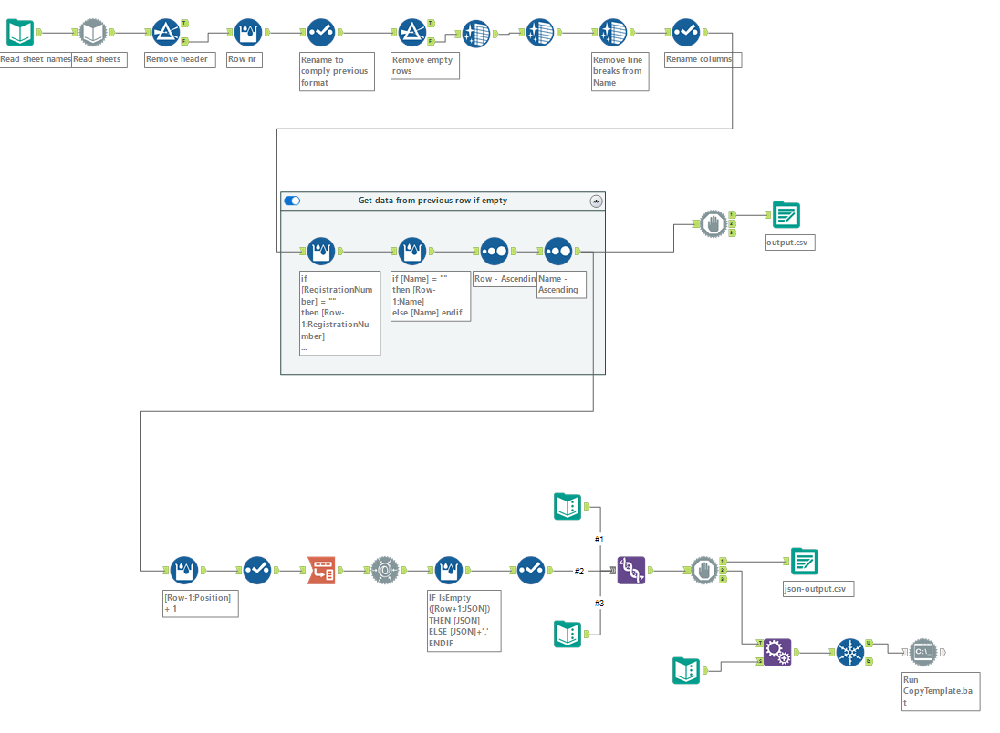

# mushroom-inspector-registry
Parsed form of the Government Office's registry Excel file containing the data of all Hungarian mushroom inspectors

# source file
The original input file is always included in OriginalInput\Latest. The old ones are in OriginalInput\History.L

Unfortunately, the latest input files are provided in pdf format.

It can be downloaded from ever-changing locations 
This actual one is from [this location at the Pest County Government Office server](https://kormanyhivatalok.hu/dokumentumtar?combine=&forras=All&field_dokumentum_cimke%5B0%5D=67&kozzeteve=All&page=1).
Exact file Address: https://kormanyhivatalok.hu/system/files/dokumentum/pest/2024-10/uj-gomba-szakellenor-nyilvantartas_202410public.pdf

(If you are lucky) You can find the ever latest version [with this Google search or similar](https://www.google.com/search?q=kormanyhivatal+gombaszakellen%C5%91r%C3%B6k+list%C3%A1ja)
The first result will be the latest pdf file.

# processing
First, the input pdf has to be converted to xlsx (as that was the previous format used and the processor can only handle that format).
Use this free online converter: [SmallPdf](https://smallpdf.com/pdf-to-excel)
It generates a multi-sheet pdf.
The sheets need to have the same schema, last time I had to move all data from Table4 and 5 to Table3 
in order to be further processable.

The xlsx file is then processed using [Alteryx Designer](https://www.alteryx.com/). 
Unfortunately it is a non-open-source data processing workflow tool.
You can view and test the .yxmd workflow if you donwload the trial.
If you don't want to use the tool, you can still have a look at the workflow by inspecting
this snapshot:

After run, the outputs are located under the folder Output.
These are to be kept up-to-date so you can use them as a data source.

# contact if
If you need other file formats feel free to ask.

Also, if you find any bugs/missing data, post a message/issue.
